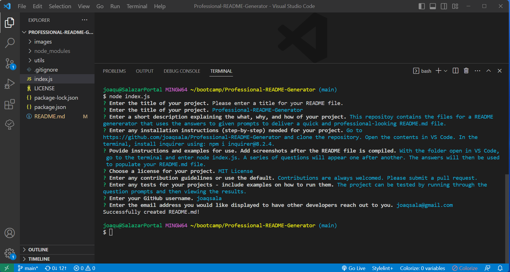

  

  # Professional-README-Generator

  ## Description
  
  This repositoy contains the files for a README genererator that uses the answers to given prompts to deliver a quick and professional-looking README.md file. The README.md file is created using node.js and the inquirer app found on npm. 

  ## Table of Contents

- [Installation](#installation)
- [Usage](#usage)
- [License](#license)
- [Contributing](#contribution)
- [Tests](#tests)
- [Questions](#questions)

## Installation

Go to https://github.com/joaqsala/Professional-README-Generator and clone the repository. Place the cloned repository into the directory where you want the README.md file. Open the terminal in VS Code, and install inquirer using: npm i inquirer@8.2.4. The app should be ready to run. Simply type 'node index.js' into the terminal and answer the prompts.

## Usage 

Video walk through: https://watch.screencastify.com/v/tPqJRD0yyZWqv4zGoSdL

This application is great for those looking for a quick and easy way to make a professional-looking README file. Using the comman line interface, a series of questions will appear - one after another. The answers will be saved and used to populate your README.md file.

## License

This project is covered under the MIT License.
 
  https://opensource.org/license/mit/

## Contribution

Contributions are always welcomed. Please submit a pull request.

## Tests

The project can be tested by running through the question prompts and then viewing the results.

## Questions

For any questions, please feel free to reach out. 

Github username: https://github.com/joaqsala

Email: joaqsala@gmail.com
